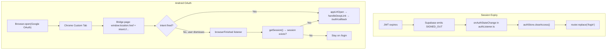

# Auth Expiry & Android Login Fix

## Root Causes

**Issue 1 — Session expiry → API errors silently fail**

- No `onAuthStateChange` listener anywhere in the app
- `authStore.isAuthenticated` is based on localStorage snapshot, not live JWT validity
- When Supabase's refresh fails and emits `SIGNED_OUT`, nothing clears the store or redirects
- Router guard passes because stale `brandwala.auth.access.v2` still exists

**Issue 2 — Android sometimes stays in browser after Google login**

- `@capacitor/browser` opens a Chrome Custom Tab
- Bridge page (`OAuthCallback.vue` on `tradeflowbd.pages.dev`) does `window.location.href = "intent://..."` without a real user gesture
- Chrome Custom Tab **may block intent:// URIs triggered by JS redirect** (not a click) in some Android versions → user stays in browser, app never receives `appUrlOpen`
- Manual "Open Thrift App Manually" button is present but easy to miss

---

## Fix 1 — Global Session Expiry Handler

**New file:** [`src/boot/authListener.ts`](src/boot/authListener.ts)

Sets up `supabase.auth.onAuthStateChange` in a Quasar boot file (has access to `router` and Pinia `store` via boot params):

```ts
import { supabase } from "src/boot/supabase";
import { useAuthStore } from "src/stores/authStore";

export default ({ router, store }) => {
  supabase.auth.onAuthStateChange((event, session) => {
    if (event === "SIGNED_OUT") {
      const authStore = useAuthStore(store);
      authStore.clearAccess();
      void router.replace("/login");
    }
  });
};
```

**Register in** [`quasar.config.ts`](quasar.config.ts): add `'~/src/boot/authListener'` to the `boot` array.

> `TOKEN_REFRESHED` needs no action — Supabase already updates its own storage and future RPCs will use the new token.

---

## Fix 2 — Android OAuth `browserFinished` Fallback

**File:** [`src/App.vue`](src/App.vue)

Add a `Browser.addListener('browserFinished', ...)` handler. When the Chrome Custom Tab closes (for any reason — successful redirect or user dismissal), check if a Supabase session now exists. If yes, bootstrap the login.

```ts
Browser.addListener("browserFinished", async () => {
  // Only relevant during native OAuth flow
  const { data } = await supabase.auth.getSession();
  if (data.session && !authStore.isAuthenticated) {
    await router.replace({
      path: "/auth/callback",
      query: { scope: "app", tenant_slug: THRIFT_TENANT_SLUG }
    });
  }
});
```

This handles the case where the intent:// redirect silently fails and the user dismisses the browser — the app will still detect the session and complete login.

Also: increase the polling loop in [`src/pages/OAuthCallback.vue`](src/pages/OAuthCallback.vue) from 30×100ms (3s) to 60×200ms (12s) for slower devices.

---

## Flow After Fix



---

## Files Changed

- `src/boot/authListener.ts` — new (8 lines)
- `quasar.config.ts` — 1-line addition to boot array
- `src/App.vue` — add `browserFinished` listener + import `useAuthStore`
- `src/pages/OAuthCallback.vue` — increase polling timeout
