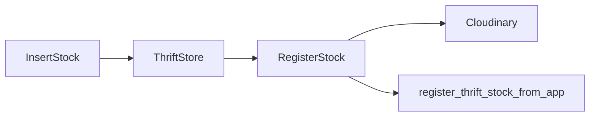

# Thrift App — AI Architecture Guide

**Read this first** before exploring the codebase. This is the single map for adding features to the Capacitor mobile app. For parity with admin/web thrift modules, see `brandwala-wholesale-quasar-v2/web/src/modules/thrift*`.

## Stack

| Layer   | Tech                                                         |
| ------- | ------------------------------------------------------------ |
| UI      | Vue 3, Quasar 2, TypeScript                                  |
| State   | Pinia + `localStorage` (workflow persistence)                |
| Native  | Capacitor 8 (camera, barcode ML Kit)                         |
| Backend | Supabase (Postgres + RLS + RPCs)                             |
| Images  | Cloudinary upload preset + `cloudinary-delete` edge function |

## Directory map

| Path                   | Role                                             |
| ---------------------- | ------------------------------------------------ |
| `src/pages/`           | Full screens (one route each)                    |
| `src/composables/`     | API calls, device logic (no UI)                  |
| `src/stores/`          | Cross-page session/workflow state                |
| `src/constants/`       | DB enum option lists shared by pages             |
| `src/utils/`           | Pure helpers (barcode, icons, Cloudinary client) |
| `src/boot/supabase.ts` | Supabase client                                  |
| `src/router/routes.ts` | Route table                                      |

## Routes & user flows

```
/login → OAuth or email
/insert-stock → pick shipment + box (stored in thriftStore)
/register-stock → scan barcode, photo, fill form, RPC save
/stock-list → paginated browse + filters
/scan-barcode → lookup item by barcode
```



## State & persistence

| Store         | Key data                                  | Storage                     |
| ------------- | ----------------------------------------- | --------------------------- |
| `authStore`   | user, tenant, membership                  | `brandwala.auth.access.v2`  |
| `thriftStore` | selected shipment/box, temp barcode/image | `brandwala.thrift.store.v1` |

`SelectedShipment` includes `purchase_currency_id` and `cost_currency_id` (required for register-stock pricing UI).

## Data layer (Supabase)

### Tables (read/write from app)

| Table                 | Use                                        |
| --------------------- | ------------------------------------------ |
| `thrift_shipments`    | Shipment picker; currency IDs              |
| `thrift_boxes`        | Box picker / create                        |
| `thrift_barcodes`     | Validate barcode before register           |
| `thrift_stocks`       | Stock rows                                 |
| `thrift_pricings`     | listed_unit_price                          |
| `thrift_stock_images` | Primary product image URL                  |
| `thrift_categories`   | Category dropdown (`id`, `name` only)      |
| `thrift_types`        | Type dropdown (`id`, `name`, `icon`)       |
| `thrift_shelves`      | Shelf dropdown                             |
| `thrift_currencies`   | Currency symbols for pricing inputs        |
| `thrift_settings`     | `default_origin_unit_price` tenant default |

### RPCs

| RPC                              | Called from                 |
| -------------------------------- | --------------------------- |
| `register_thrift_stock_from_app` | `useThriftStockRegister.ts` |
| `resolve_thrift_barcode`         | `useThriftBarcode.ts`       |
| `list_thrift_stocks_paginated`   | `useThriftStockList.ts`     |

## Domain contracts

### Enums (`src/constants/thriftEnums.ts`)

| Postgres enum      | App constant               | Values                                       |
| ------------------ | -------------------------- | -------------------------------------------- |
| `thrift_condition` | `THRIFT_CONDITION_OPTIONS` | `NEW_WITH_TAGS`, `EXCELLENT`, `GOOD`, `FAIR` |
| `thrift_section`   | `THRIFT_SECTION_OPTIONS`   | `MALE`, `FEMALE`, `UNISEX`, `KIDS`, `HOME`   |

**Never** use `MENS`/`WOMENS` or `NEW`/`LIKE_NEW` — they fail RPC casts.

### Units & money

- **Weight:** grams (`product_weight`, `extra_weight`)
- **Purchase currency** (from shipment `purchase_currency_id`): `origin_unit_price`, `extra_origin_unit_price`
- **Cost currency** (from shipment `cost_currency_id`): `listed_unit_price`

### Icons

- **Types:** `thrift_types.icon` → `resolveTypeIcon()` in `src/utils/typeIcon.ts`
- **Categories:** static Material icon `category` (no DB column)

## Composables index

| File                        | Purpose                                                                                         |
| --------------------------- | ----------------------------------------------------------------------------------------------- |
| `useThriftStockRegister.ts` | Cloudinary upload + `register_thrift_stock_from_app` RPC                                        |
| `utils/cloudinaryClient.ts` | Cloudinary upload, `delete_by_token` (session orphans), edge-function delete (persisted images) |
| `useThriftCatalog.ts`       | Categories, types, shelves, default purchase price                                              |
| `useThriftCurrency.ts`      | Load `thrift_currencies`, `currencyById()` lookup                                               |
| `useThriftBarcode.ts`       | Barcode validation for registration                                                             |
| `useThriftStockList.ts`     | Paginated stock list                                                                            |
| `useBarcodeScan.ts`         | Capacitor ML Kit scanner                                                                        |
| `useProductPhoto.ts`        | Camera capture + crop                                                                           |
| `useOAuthLogin.ts`          | Google OAuth + deep link callback                                                               |

## Where to add X

| Change                    | Files                                                                       |
| ------------------------- | --------------------------------------------------------------------------- |
| New screen                | `src/pages/*.vue` + `src/router/routes.ts` + `MainLayout.vue` nav if needed |
| New Supabase query/RPC    | `src/composables/useThrift*.ts`                                             |
| Cross-page workflow state | `src/stores/thriftStore.ts`                                                 |
| DB enum options           | `src/constants/thriftEnums.ts`                                              |
| Shared pure helper        | `src/utils/`                                                                |

## UI conventions

See [UI_CONSISTENCY_GUIDE.md](./UI_CONSISTENCY_GUIDE.md). App-specific classes: `bw-page`, `app-card`, `app-cta-btn`, `app-section-title`, `app-context-banner`.

## Env vars

| Var                                | Purpose                                        |
| ---------------------------------- | ---------------------------------------------- |
| `VITE_SUPABASE_URL`                | Supabase project URL                           |
| `VITE_SUPABASE_ANON_KEY`           | Supabase anon key                              |
| `VITE_CLOUDINARY_CLOUD_NAME`       | Image upload                                   |
| `VITE_CLOUDINARY_UPLOAD_PRESET`    | Unsigned upload preset                         |
| `VITE_GOOGLE_DRIVE_UPLOAD_ENABLED` | Keep `false` on mobile; Drive sync is web-only |

Supabase Edge Function: `cloudinary-delete`. Drive backup is documented in [TRADEFLOWBD_DRIVE_UPLOADER.md](../brandwala-wholesale-quasar-v2/doc/TRADEFLOWBD_DRIVE_UPLOADER.md) (web admin Google login).

Cloudinary secrets: `CLOUDINARY_CLOUD_NAME`, `CLOUDINARY_API_KEY`, `CLOUDINARY_API_SECRET`.

### Image cleanup rules

- **Replace / remove (save):** `cleanupStockImageAssets` — Cloudinary + Drive when `drive_file_id` exists
- **Failed save orphan:** `cleanupStockImageAssets` or `deleteCloudinaryByToken`

## Feature changelog

_Update this section when shipping features._

- **2026-06-28** — P6 Mobile RPC Alignment: Read/write post-P1 renamed columns (`origin_unit_price`, `extra_origin_unit_price`, `listed_unit_price`), updated `register_thrift_stock_from_app` params, and simplified mobile UI to origin & listed price only (dropped COGS/target/extra).
- **2026-06-26** — Drive backup: web-only shipment sync via admin Google login (`shipmentDriveSyncClient.ts`, `ThriftShipmentPage`); mobile Cloudinary-only.
- **2026-06-22** — Cloudinary lifecycle cleanup: `cloudinaryClient.ts`; delete persisted images on stock delete (Quasar), image replace/crop/remove; rollback in-session uploads via `delete_token`.
- **2026-06-21** — Register Stock: required brand/condition/weight; section/condition DB enums; type/category dropdown icons; purchase vs cost currency groups; expense fields (`extra_origin_purchase_expense`, `extra_expense_cost`); `useThriftCurrency`, `thriftEnums.ts`, `typeIcon.ts`; shipment currency IDs on `SelectedShipment`.
